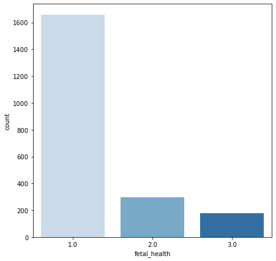

# Fetal Heath Classification

### Author: Pengju Sun

## Data Understanding
"Reduction of child mortality is reflected in several of the United Nations' Sustainable Development Goals and is a key indicator of human progress. The UN expects that by 2030, countries end preventable deaths of newborns and children under 5 years of age, with all countries aiming to reduce under‑5 mortality to at least as low as 25 per 1,000 live births.

Parallel to notion of child mortality is of course maternal mortality, which accounts for 295 000 deaths during and following pregnancy and childbirth (as of 2017). The vast majority of these deaths (94%) occurred in low-resource settings, and most could have been prevented.

In light of what was mentioned above, Cardiotocograms (CTGs) are a simple and cost accessible option to assess fetal health, allowing healthcare professionals to take action in order to prevent child and maternal mortality. The equipment itself works by sending ultrasound pulses and reading its response, thus shedding light on fetal heart rate (FHR), fetal movements, uterine contractions and more."  

The dataset used for this project can be found at https://www.kaggle.com/andrewmvd/fetal-health-classification. It contains 2,126 rows of 22 features extracted from Cardiotocogram (CTG) exams, which were then classified by three expert obstetritians into 3 classes:
* Normal
* Suspect 
* Pathological  

Cardiotocograms (CTGs) measure values such as fetal heart rate, fetal movement, and uterine contractions. "CTGs are a simple and cost-accessible option to assess fetal health, allowing healthcare professionals to take action in order to prevent child and maternal mortality."  Using data from actual patients' CTG exams and their accomponaying fetal health outcomes assigned by expert obstetricians, I have determined that automated assessment of fetal health is possible using CTG data.

## Medical Problem

Since fetal risk and mortality is such a devastating problem, what can be done to decrease these numbers and preserve maternal and fetal health? I will be answering the question of how to predict fetal health outcomes based on CTG data. This information can be used by medical professionals, specifically in the field of obstetrics, to minimize the occurrence of fetal mortality. 

I will be working towards answering the following questions:

1. Can performing CTGs as preventative care help predict fetal health outcomes?
2. If so, which measures on a CTG exam are most significant when predicting fetal health outcomes?

## Hypotheses  

Null hypothesis (H0): There is no relationship between automated CTG data and fetal health outcome.  

Alternative hypothesis (Ha): There is a relationship between automated CTG data and fetal health outcome

## Method

I imported the data first. And then, I started to explore the data with descriptive statistics and visualizations to illuminate trends in the data and found critical features for making fetal health predictions. The data was cleaned, processed, scaled, and adjusted for class imbalance by using SMOTE method. After that, I put ready-to-go data into different machine learning algorithms to make prediction models. The grid search method was used to iterate through models and find optimal hyperparameters. I determined my best model based on the recall metric for this particular case.

The target class, fetal health, is very unbalanced. The majority of the fetal health outcomes observed in this dataset are 1.00, which is the designation for Normal fetal health. The class with the second-highest frequency is the 2.00 or Suspect fetal health class. The class with the lowest frequency in this dataset is 3.00 or Pathological fetal health.  

To make the data slightly easier to work with and understand, and turn this into a binary classification problem, I combined the 2.00 and 3.00 classes of Suspect and Pathological fetal health into a category called At Risk. I designated all the values of 1.00 as Normal.

## Significant Features

Prolonged_decelerations has the strongest correlation with the target variable. The greater number of prolonged decelerations, the greater the risk.

Percentage_of_time_with_abnormal_short_term_variability also has a strong impact on the fetal health outcome. The higher the percentage of time with abnormal short-term variability, the higher the chances at risk.

There was a clear relationship between abnormal short and long term fetal heart rate variability and fetal health outcome.

## Models

All models were primarily evaluated on the recall/sensitivity metric to determine which model performed best. I iterated through eight models in total, optimizing for hyperparameters along the way: baseline (Decision Tree), Class_weight_balanced (Decision Tree), Decision Tree (SMOTE), Logistic Regression, Random Forest, Gradient Boosting, Support Vector Machine, and XGBoost.

Out of all the models evaluated with optimized hyperparameters, the Support Vector Machine classifier performed the best, with a recall rate of 95%. This means that 94% of the at-risk class was captured by the model. It has an accuracy score of 91%, meaning that 91% of the total predictions made by the model were correct. It is important to note that while there is a trade-off between recall and precision, which affects accuracy, you simply cannot put a price on human life.

The ROV curve and precision-recall curve show that while recall was prioritized, the model still did pretty well with precision too. The AUC of 97.4& also shows that this model works really well. 

## Conclustion

In conclusion, CTGs data provide easily accessible and interpretable insight into fetal health conditions. Machine learning models are able to predict if a fetus is at risk or normal using CTG data with a high level of recall score.

## Recommendation

1. Based on my findings, cardiotocogram readings are able to predict fetal health outcomes. My main recommendation is that CTGs should be performed as often as possible on mothers in pregnancy. This is a highly interpretable way to maintain the necessary level of care to track maternal and fetal health.

2. My second recommendation is that healthcare providers pay close attention to all measures of fetal heart rate, as these are the strongest predictors of at-risk fetal health outcomes. These measures include the percentage of time with abnormal short-term variability, the percentage of time with abnormal long-term variability, and prolonged decelerations.

3. My final recommendation is to treat all indicators of at-risk outcomes with urgency and a better-safe-than-sorry approach. Always put human life as the top priority.

## Future Work

1. As CTG use is widely implemented for all pregnant mothers, we would use more new observations data and fetal health outcomes to further improve the modeling sensitivity score in order to never miss a single instance of at-risk fetal health.

2. In the data we already have, there are many features of fetal heart histograms generated by the CTG exam. We have not yet explored the impact of these CTG histograms and what their values mean for fetal health predictions.

3. By adding new features, such as obstetrician's periodic checking reports, we could find new trends and have more information to make predicitons. 

